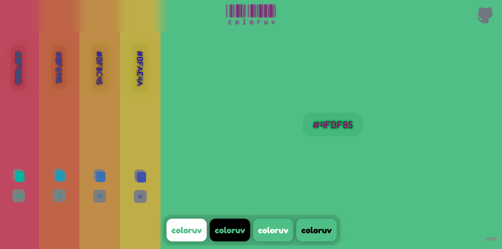

  <h1>
    
    coloruv
  </h1>
  <strong>
    A minimal natural color picker
  </strong>
   
   
    interactive color picker
   
    that transforms your screen into a living palette
   
  

  
   
  <h3>
  🌐 <a href="https://metaory.github.io/coloruv">metaory.github.io/coloruv</a>
  </h3>
   
  

---

### How it works

- **Horizontal movement** → hue
- **Vertical movement** → saturation/brightness
- **Click** → save to palette

Active area shrinks as palette grows for focused workspace

---

### Credits

Inspired by [github.com/devinhunt/colordot](https://github.com/devinhunt/colordot) 
_([color.hailpixel.com](https://color.hailpixel.com))_

---

### License

[MIT](LICENSE)
